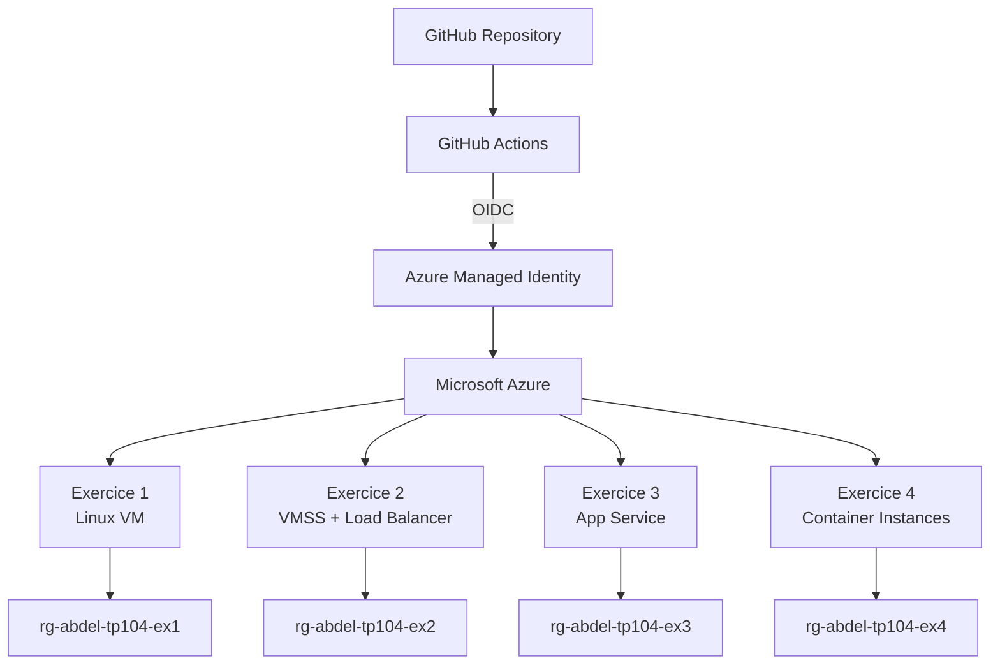
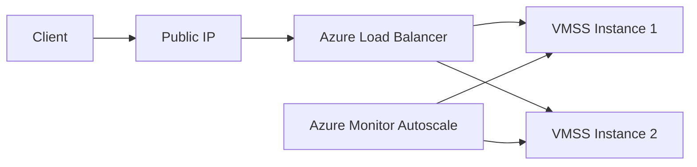
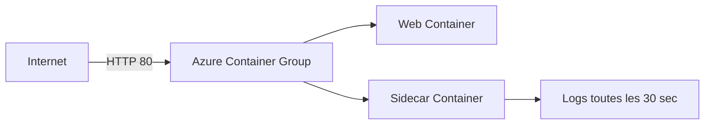
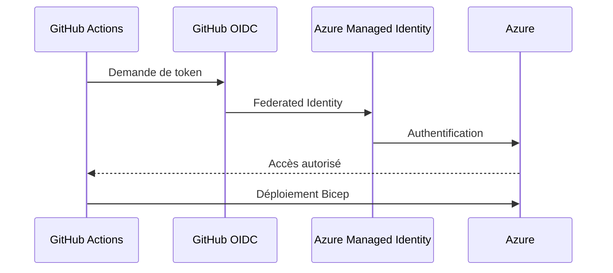

# ☁️ TP Bicep — R
---

## 📌 Présentation

Ce projet a pour objectif de déployer différentes ressources de calcul Azure en utilisant **Bicep** comme outil d'Infrastructure as Code.

Le TP permet notamment de mettre en pratique :

- la création de ressources Azure avec Bicep ;
- les paramètres, variables, outputs et dépendances ;
- les machines virtuelles et VM Scale Sets ;
- Azure Load Balancer ;
- Azure App Service ;
- Azure Container Instances ;
- l'autoscaling ;
- les slots de déploiement ;
- l'automatisation avec GitHub Actions ;
- l'authentification Azure avec **OIDC et Managed Identity** ;
- le provisioning et la destruction automatisés.

---

## 🏗️ Architecture globale



---

## 📂 Structure du projet

```text
TP-Bicep-Azure/
│
├── .github/
│   └── workflows/
│       ├── bicep-provision.yml
│       └── bicep-destroy.yml
│
├── ex1-vm/
│   └── main.bicep
│
├── ex2-vmss/
│   └── main.bicep
│
├── ex3-appservice/
│   └── main.bicep
│
├── ex4-aci/
│   └── main.bicep
│
├── REFLEXION-TERRAFORM-VS-BICEP.md
├── .gitignore
└── README.md
```

---

# 🚀 Exercices réalisés

| Exercice | Ressources principales | Fonctionnalités | Statut |
|---|---|---|:---:|
| **1 — VM Linux** | VM, VNet, NSG, NIC, Public IP | SSH, Nginx, Custom Script | ✅ |
| **2 — VMSS** | VM Scale Set, Load Balancer | Load balancing, autoscaling | ✅ |
| **3 — App Service** | App Service Plan, Web App | Container, staging slot, swap | ✅ |
| **4 — ACI** | Container Group | Web container + sidecar | ✅ |
| **GitHub Actions** | OIDC + Managed Identity | Provision / Destroy | ✅ |

---

## 🖥️ Exercice 1 — Machine virtuelle Linux

Déploiement d'une machine virtuelle **Ubuntu 22.04** accompagnée de son infrastructure réseau.

### Ressources

- Virtual Network ;
- subnet ;
- Network Security Group ;
- Network Interface ;
- Public IP Standard ;
- machine virtuelle Linux ;
- extension Custom Script.

### Sécurité

Le NSG autorise :

```text
SSH  : TCP/22 → uniquement depuis une IP autorisée
HTTP : TCP/80 → Internet
```

L'accès SSH utilise une **clé publique** et l'authentification par mot de passe n'est pas utilisée.

### Configuration automatique

Une extension Azure installe automatiquement **Nginx** sur la VM.

La page web affiche le hostname de la machine :

```html
<h1>Serveur : abdel-vm</h1>
```

### Vérifications

```bash
curl http://<PUBLIC_IP>
```

```bash
ssh abdel@<PUBLIC_IP>
```

---

## ⚖️ Exercice 2 — VM Scale Set + Load Balancer

Déploiement d'une architecture capable de distribuer les requêtes HTTP entre plusieurs machines virtuelles.

### Architecture



### Fonctionnalités

- Azure VM Scale Set ;
- minimum de **2 instances** ;
- Azure Load Balancer Standard ;
- backend pool ;
- TCP Health Probe ;
- règle HTTP sur le port 80 ;
- Nginx installé automatiquement ;
- autoscaling basé sur l'utilisation CPU.

### Politique d'autoscaling

```text
CPU > 70 % pendant 5 minutes
        ↓
Ajout d'une instance

CPU < 30 % pendant 5 minutes
        ↓
Suppression d'une instance
```

### Test du Load Balancer

Les requêtes ont été envoyées en parallèle afin de vérifier leur répartition entre les instances du VMSS.

```bash
curl http://<LOAD_BALANCER_IP>
```

Les réponses ont confirmé l'utilisation des différentes instances :

```text
vmss000000
vmss000001
```

---

## 🌐 Exercice 3 — Azure App Service

Déploiement d'une application conteneurisée avec **Azure App Service**.

### Ressources

- App Service Plan Linux ;
- SKU `S1` ;
- Web App ;
- HTTPS activé ;
- slot `staging`.

### Slots de déploiement

Deux environnements sont disponibles :

```text
Production
    │
    └── Web App

Staging
    │
    └── Deployment Slot
```

Le mécanisme de **slot swap** a été testé avec deux applications différentes.

Avant le swap :

```text
Production → Azure Container Instances demo
Staging    → Nginx
```

Après le swap :

```text
Production → Nginx
Staging    → Azure Container Instances demo
```

Cela permet de changer de version d'application avec très peu d'interruption.

---

## 📦 Exercice 4 — Azure Container Instances

Déploiement d'un **Container Group Azure** composé de deux conteneurs.



### Conteneur principal

Le conteneur principal :

- exécute une application web ;
- possède une IP publique ;
- possède un nom DNS ;
- expose le port `80`.

### Sidecar

Le second conteneur fonctionne en arrière-plan sans exposer de port.

Il écrit un message toutes les 30 secondes :

```text
Fri Sep 11 07:39:14 UTC 2026 - sidecar actif
Fri Sep 11 07:39:44 UTC 2026 - sidecar actif
Fri Sep 11 07:40:14 UTC 2026 - sidecar actif
```

### Vérifications

```bash
curl http://<ACI_FQDN>
```

```bash
az container logs \
  --resource-group rg-abdel-tp104-ex4 \
  --name abdel-aci \
  --container-name sidecar
```

Les deux conteneurs ont été vérifiés en état :

```text
web      Running
sidecar  Running
```

---

# 🔄 CI/CD — GitHub Actions

Le déploiement et le nettoyage de l'infrastructure sont automatisés avec **GitHub Actions**.

Deux workflows sont disponibles :

```text
.github/workflows/
├── bicep-provision.yml
└── bicep-destroy.yml
```

---

## 🟢 Workflow — Provision

Le workflow **Bicep Provision** :

1. récupère le dépôt ;
2. s'authentifie auprès d'Azure ;
3. installe Bicep ;
4. récupère l'IP du runner GitHub ;
5. crée les Resource Groups ;
6. déploie les quatre exercices.



Le workflow a été exécuté avec succès :

```text
✓ Azure login with OIDC
✓ Deploy Exercise 1 - VM
✓ Deploy Exercise 2 - VMSS
✓ Deploy Exercise 3 - App Service
✓ Deploy Exercise 4 - ACI

✓ Bicep Provision — SUCCESS
```

---

## 🔴 Workflow — Destroy

Le workflow **Bicep Destroy** permet de supprimer automatiquement les Resource Groups du TP.

```text
rg-abdel-tp104-ex1
rg-abdel-tp104-ex2
rg-abdel-tp104-ex3
rg-abdel-tp104-ex4
```

Le workflow a également été exécuté avec succès :

```text
✓ Azure login with OIDC
✓ Delete TP resource groups

✓ Bicep Destroy — SUCCESS
```

---

# 🔐 Authentification et sécurité

Le pipeline GitHub Actions utilise **OIDC (OpenID Connect)** pour s'authentifier auprès d'Azure.

```text
GitHub Actions
      │
      │ OIDC Token
      ▼
Azure Managed Identity
      │
      ▼
Azure RBAC
      │
      ▼
Azure Resources
```

Cette méthode évite de stocker un mot de passe ou un secret Azure longue durée dans GitHub.

### Principes appliqués

- ✅ aucune clé privée SSH dans Git ;
- ✅ aucun mot de passe Azure dans le dépôt ;
- ✅ authentification GitHub → Azure avec OIDC ;
- ✅ Managed Identity ;
- ✅ permissions Azure via RBAC ;
- ✅ clé SSH publique passée comme variable ;
- ✅ accès SSH limité par NSG.

---

# 🧪 Commandes utilisées

<details>
<summary><strong>Compiler un fichier Bicep</strong></summary>

```bash
az bicep build --file main.bicep
```

</details>

<details>
<summary><strong>Déployer avec Bicep</strong></summary>

```bash
az deployment group create \
  --resource-group <RESOURCE_GROUP> \
  --template-file main.bicep
```

</details>

<details>
<summary><strong>Prévisualiser les modifications</strong></summary>

```bash
az deployment group what-if \
  --resource-group <RESOURCE_GROUP> \
  --template-file main.bicep
```

</details>

<details>
<summary><strong>Tester une application HTTP</strong></summary>

```bash
curl http://<IP_OU_FQDN>
```

</details>

<details>
<summary><strong>Vérifier les instances VMSS</strong></summary>

```bash
az vmss list-instances \
  --resource-group <RESOURCE_GROUP> \
  --name <VMSS_NAME> \
  -o table
```

</details>

<details>
<summary><strong>Consulter les logs ACI</strong></summary>

```bash
az container logs \
  --resource-group <RESOURCE_GROUP> \
  --name <CONTAINER_GROUP> \
  --container-name sidecar
```

</details>

---

# 🧹 Nettoyage

Le nettoyage peut être exécuté directement depuis GitHub Actions avec :

```text
Bicep Destroy
```

Une vérification peut ensuite être effectuée avec :

```bash
az group list \
  --query "[?starts_with(name, 'rg-abdel-tp104')].name" \
  -o table
```

Une sortie vide confirme que les ressources du TP ont été supprimées.

---

# 🆚 Terraform vs Bicep

Une réflexion complémentaire comparant **Terraform** et **Bicep** est disponible dans :

➡️ [`REFLEXION-TERRAFORM-VS-BICEP.md`](./REFLEXION-TERRAFORM-VS-BICEP.md)

Les sujets abordés sont :

- gestion de l'état ;
- portabilité multi-cloud ;
- support des services Azure ;
- syntaxe et modules ;
- provisioning et destruction en CI/CD.

---

## ✅ État du projet

```text
Exercice 1 — VM Linux                  ✅
Exercice 2 — VMSS + Load Balancer      ✅
Exercice 3 — App Service + Slots        ✅
Exercice 4 — Azure Container Instances ✅
GitHub Actions — Provision             ✅
GitHub Actions — Destroy               ✅
Nettoyage final                         ✅
```

---

## 👤 Auteur

**Abdel Benslimane**

Formation **Administrateur Système DevOps**  
École Cloud Microsoft by Simplon

GitHub : [@A-benslimane](https://github.com/A-benslimane)
